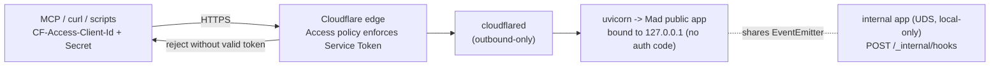

# Authentication and Authorization

Mad has **no in-app authentication or authorization layer** — and that is a
deliberate design decision, not an omission. Mad trusts its network boundary:
authentication happens at the **Cloudflare edge** (Service-Token Access), and
Mad's source tree carries no auth middleware, no login flow, no API keys, and
no per-caller identity. This document describes the edge model, the one
in-process knob that touches this area (`MAD_MCP_ALLOWED_HOSTS`), and the token
hygiene Mad *does* enforce (CLAUDE.md hard rule 2).

## The model: trust the boundary, auth at the edge

There is no auth code in any Mad inbound adapter. `create_app(...)` in
`src/mad/adapters/inbound/http/app.py` wires routes with no authentication or
authorization middleware — a grep for `auth`, `middleware`, `cors`, or `token`
in that file returns nothing. The same is true of the MCP adapter
(`src/mad/adapters/inbound/mcp/server.py`): tools call use cases in-process and
return raw status; none of them check a caller identity.

Real authentication lives **outside the process**, at the Cloudflare edge,
using **Service-Token Access** (ADR-0010, ADR-0006). The recommended exposure
is a Cloudflare Tunnel: `cloudflared` opens an outbound-only connection to
Cloudflare's edge, and a Cloudflare Access policy rejects every request that
does not present a valid Service Token (`CF-Access-Client-Id` /
`CF-Access-Client-Secret` headers). Mad never sees an unauthenticated request.
The full operator recipe — tunnel, Access application, Service Token minting,
verification — is in [`docs/05-operations/runbooks/cloudflare-tunnel.md`](../05-operations/runbooks/cloudflare-tunnel.md).

Two structural facts make this posture safe:

- **Mad binds to loopback (`127.0.0.1`), not `0.0.0.0`.** The tunnel is the
  only intended ingress; the listener is never published to the LAN or the
  public internet directly.
- **The internal hook adapter never leaves the host.** `POST /_internal/hooks`
  is bound to a Unix domain socket (`/tmp/mad/hooks.sock`) on the internal app,
  not the public TCP app, and is never tunneled (ADR-0008).



### Why no in-app auth (the threat model)

This is not a gap to be filled casually. `POST /v1/sessions/{id}/messages`
launches `claude --dangerously-skip-permissions` against a workspace clone —
**arbitrary code execution as the Mad uid, by design.** Anyone who reaches the
API can read, write, and execute as that uid. That is acceptable only because
Cloudflare Access is the gate in front of it. The operator guide is blunt: do
not point a hostname at the tunnel without an Access policy attached, not even
"for a minute."

### Authorization: none, single-operator

Mad assumes a **single operator** and does not differentiate callers once they
pass the edge (ADR-0006, multi-tenancy deferred). There are no roles, scopes,
or per-caller event isolation: any authenticated client of a shared instance
would see every other client's session log. The recommended pattern for
multiple users is **one Mad instance and one tunnel hostname per user**, not a
shared instance — see [`docs/05-operations/runbooks/cloudflare-tunnel.md`](../05-operations/runbooks/cloudflare-tunnel.md)
("Future expansion") and [ADR-0006](../adr/0006-multi-tenancy-deferred.md).

## `MAD_MCP_ALLOWED_HOSTS` — opt-in DNS-rebinding protection

The MCP SDK ships its own Host-header / DNS-rebinding protection. Mad turns it
**off by default** and exposes one environment variable to opt back in. This is
implemented in `_transport_security()` in
`src/mad/adapters/inbound/mcp/server.py`:

- **Unset / empty (default):** DNS-rebinding protection is **disabled**
  (`TransportSecuritySettings(enable_dns_rebinding_protection=False)`). The
  SDK's default is ON with an *empty* host allowlist, which rejects every Host
  header — including the Cloudflare Tunnel hostname this adapter is designed to
  be reached through. Leaving it on by default would break the deployment
  entirely.
- **Set to a comma-separated host list:** protection is **enabled** and scoped
  to exactly those hosts (`enable_dns_rebinding_protection=True`,
  `allowed_hosts=[...]`). Operators who want in-process defense-in-depth set,
  for example, `MAD_MCP_ALLOWED_HOSTS=mad.example.com`.

The rationale (ADR-0010, decision 5): DNS-rebinding protection guards
browser-driven *local* servers; it is not the control for a token-gated tunnel.
The real control is Cloudflare Access. The in-Mad host allowlist is offered
only as opt-in defense-in-depth, because mandating it would contradict the
edge-auth posture.

## Token hygiene (hard rule 2)

The one credential Mad handles directly is the per-request GitHub token used to
clone a private repository — supplied as `authorization_token` on a resource in
the `POST /v1/sessions` body. Hard rule 2 governs it: **the token is used only
for `git clone`, then stripped, and is never persisted to the workspace, the
session log, or stdout.**

Enforcement is in two places:

1. **Stripped from the clone remote.** In
   `src/mad/adapters/outbound/persistence/local_workspace_provisioner.py`, the
   token is embedded in the clone URL only for the `git clone`, then immediately
   removed with `git remote set-url origin <url-without-token>`. The workspace's
   `.git/config` never retains the token.

   ```python
   clone_url = repo_url
   if token and repo_url.startswith("https://"):
       clone_url = repo_url.replace("https://", f"https://{token}@", 1)
   subprocess.run(["git", "clone", "-q", clone_url, str(local_path)], check=True, ...)
   # Strip token from remote after clone (CLAUDE.md hard rule 2)
   subprocess.run(["git", "-C", str(local_path), "remote", "set-url", "origin", repo_url], ...)
   ```

2. **Redacted from the event log.** Tokens are collected at session creation
   into `session.tokens_to_redact`, held **in memory only** and never persisted
   (`src/mad/core/sessions/use_cases/create_session.py`,
   `src/mad/core/sessions/domain/entities/session.py`). Event payloads are
   redacted against that list before being written or streamed
   (`_redact_tokens` / `_collect_tokens` in
   `src/mad/core/sessions/use_cases/send_user_message.py`). Separately, agent
   stderr is scrubbed for credential-shaped strings (`sk-ant-...` and
   `token`/`key`/`secret`/`password` assignments become `[REDACTED]`) by
   `_scrub` in `src/mad/adapters/outbound/agents/_subprocess.py`, used by both
   the `claude_cli` and `opencode` launchers before stderr is emitted.

A caveat worth surfacing for operators: the clone token still transits the
Cloudflare edge inside the request body. Cloudflare's defaults do not log
request bodies, but the token is observable by Cloudflare in principle — treat
it as such and rotate on a schedule (see "Request body privacy" in
[`docs/05-operations/runbooks/cloudflare-tunnel.md`](../05-operations/runbooks/cloudflare-tunnel.md)).

## When this changes

The edge-only posture is recorded as a deliberate trade-off. ADR-0010 lists the
triggers to revisit it: if multi-tenancy lands (ADR-0006), per-caller event
isolation and per-tenant MCP semantics become necessary; if OAuth 2.1 / dynamic
client registration is adopted, the edge-auth assumption changes and
`auth_server_provider` wiring would enter the adapter. Until then, do not add
in-app auth — supersede the ADR first.

## References

- [ADR-0010](../adr/0010-mcp-mounted-http-inbound-adapter.md) — MCP mounted
  adapter; authentication stays at the Cloudflare edge; DNS-rebinding protection
  off by default.
- [ADR-0006](../adr/0006-multi-tenancy-deferred.md) — single-operator
  assumption; multi-tenancy deferred.
- [ADR-0008](../adr/0008-internal-hook-adapter-and-vocabulary.md) — internal
  hook adapter on a local-only UDS, never tunneled.
- [`docs/05-operations/runbooks/cloudflare-tunnel.md`](../05-operations/runbooks/cloudflare-tunnel.md) — operator guide for
  Service-Token Access at the edge.
- CLAUDE.md hard rule 2 — token hygiene.
