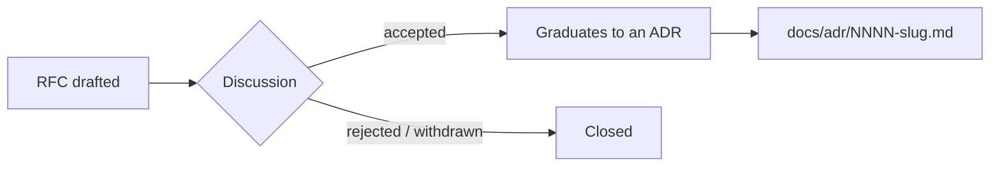

# RFCs

Free-form proposals and their trade-offs (pre-decision). Index + one file per RFC.

## What an RFC is here

An RFC ("Request for Comments") is a proposal that is still **being discussed** — it lays out a problem, one or more options, and their trade-offs so the team can weigh them before anything is settled. RFCs are deliberately exploratory: they may be revised, withdrawn, or rejected.

## RFC vs ADR

| | RFC (this section) | ADR (`docs/adr/`) |
|---|---|---|
| Stage | Pre-decision proposal | Recorded decision |
| Content | Problem + options + trade-offs, still open | Chosen option + consequences, settled |
| Mutability | Revised freely while under discussion | Immutable once Accepted; changed only by a superseding ADR |

ADRs are catalogued in [`../07-decisions/README.md`](../07-decisions/README.md) and live as `NNNN-kebab-slug.md` files under [`../adr/`](../adr/README.md). Mad's load-bearing decisions (testing strategy, package layout, events scope, HTTP↔MCP parity, …) already live there. This section is the upstream stage that feeds it.

## Lifecycle

An accepted RFC does not stay here as the decision of record — it **graduates** to an ADR under `docs/adr/`, which becomes the authoritative, immutable record. Rejected or withdrawn RFCs are closed and kept only for historical context.

## Convention

- One file per RFC, named `NNNN-slug.md` (zero-padded, sequential — `0001-some-proposal.md`), mirroring the ADR filename convention.
- A new proposal starts as a file in this directory; reference it from this index while it is under discussion.
- `backlog.md` is the unnumbered proposal inbox — lower-ceremony than a numbered RFC. Items graduate to a numbered `NNNN-slug.md` RFC or directly to an ADR when picked up.

## Index

| File | What it is |
|---|---|
| [`backlog.md`](backlog.md) | Unnumbered pre-RFC inbox — improvements deferred past v0.1, not yet promoted to a numbered RFC. |

No numbered RFCs yet. New proposals go here as `NNNN-slug.md` and are linked from this table.
