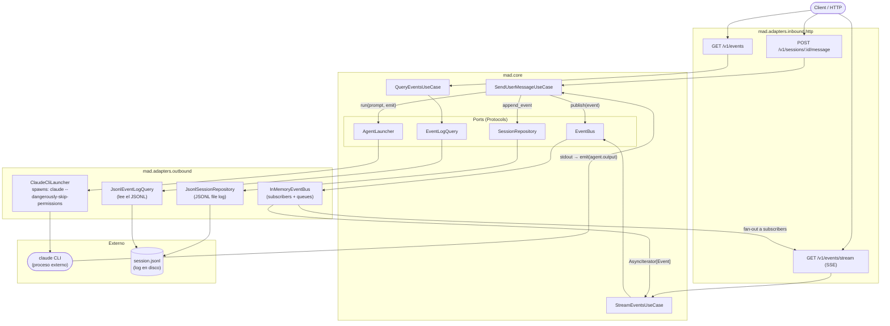

# Events Architecture

## Flujos principales

**Escritura** — El mensaje entra por HTTP, `SendUserMessage` persiste en JSONL, publica al bus,
y le pasa el control al launcher externo. El launcher devuelve líneas de stdout via el callback
`emit()`, que vuelve a pasar por el mismo ciclo.

**Lectura histórica** — `GET /v1/events` va directo al JSONL via `JsonlEventLogQuery`,
sin tocar el bus.

**Streaming en vivo** — `GET /v1/events/stream` se subscribe al `InMemoryEventBus`
y recibe eventos a medida que se publican.
