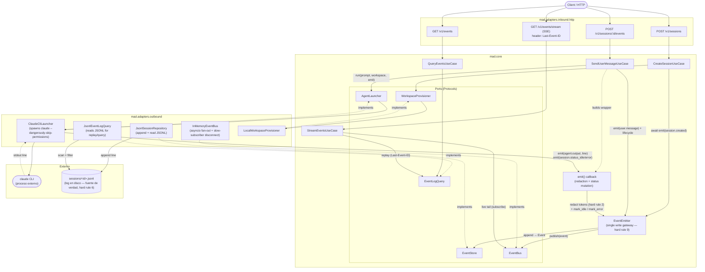

# Events Architecture

## Reglas que el diagrama codifica

- **Hard rule 9** — `EventEmitter.emit()` es la única ruta de escritura al log. Los use cases dependen de `EventEmitter`; nunca llaman `EventStore.append` o `EventBus.publish` directamente. Los adaptadores outbound (launcher) **reciben** un callable `emit` que el use case construye; no conocen al emitter.
- **Hard rule 6** — el JSONL es la fuente de verdad. `EventEmitter.emit()` persiste *antes* de publicar; si publish falla, el evento ya está en disco.
- **Hard rule 2** — la redacción de tokens vive en el wrapper `emit()` que el use case construye antes de pasarlo al launcher. Nunca llega un token sin redactar al `EventStore`.
- **Hard rule 4** — `mad.core` no importa FastAPI ni adaptadores. Las flechas hacia `Adapters_Out` cruzan puertos; las flechas a puertos desde adaptadores son `implements` (dashed).
- **Hard rule 8** — el módulo `events` solo observa: `QueryEvents`/`StreamEvents` son lectura; `EventEmitter` no clasifica ni traduce, solo persiste y publica el vocabulario verbatim.

## Flujos principales

### 1. Crear sesión (`POST /v1/sessions`)
1. La ruta construye `CreateSessionUseCase` con `provisioner`, `sessions_index`, `idempotency_index`, `emitter`.
2. El use case provisiona el workspace (clona repos, escribe ficheros) vía `WorkspaceProvisioner`.
3. Emite `session.created` con `await emitter.emit(...)`. El evento se persiste y se publica al bus en el mismo paso.
4. Devuelve `{session_id, status, workspace, resources_mounted}`.

### 2. Mandar un mensaje (`POST /v1/sessions/:id/events`)
1. La ruta llama `SendUserMessageUseCase.execute()` (sync) que programa dos `asyncio.create_task`:
   - `emitter.emit(session_id, "user.message", {...})` — persistencia + publish del mensaje del usuario.
   - `_run_launcher(...)` — ejecuta el agente.
2. `_run_launcher` emite `session.status_running`, construye un wrapper `emit()` que **(a)** redacta tokens, **(b)** llama a `emitter.emit`, y **(c)** muta el estado de la `Session` en `session.status_idle`/`session.error`.
3. Pasa ese wrapper al `AgentLauncher.run(prompt, workspace, emit)`.
4. El launcher spawneará `claude` y por cada línea de stdout llamará `emit("agent.output", {...})`. Al terminar, emite `session.status_idle` (exit 0) o `session.error`.
5. Tras el primer run, el use case lanza un segundo run con `build_auto_sync_prompt(...)` (issue #8) usando el mismo workspace y el mismo wrapper `emit`.

### 3. Lectura histórica (`GET /v1/events`)
- `QueryEventsUseCase` consulta `EventLogQuery` (que escanea los JSONL en disco). No toca el bus. Soporta filtros `session_id`, `kind`, `agent`, `since`, paginación con `after_event_id`/`limit`. No hay ventana de retención: el log es la base.

### 4. Streaming en vivo (`GET /v1/events/stream`)
`StreamEventsUseCase` ejecuta el siguiente protocolo (ADR-0004 dedup boundary, ADR-0005 UUIDv7):
1. **Subscribe primero** al `EventBus` con el filtro pedido — los eventos en vivo se bufferean en la cola del subscriber mientras corre el replay.
2. Si la petición trae header `Last-Event-ID`, hace **replay paginado** desde `EventLogQuery` (`after_event_id=last`, páginas de 1000) y lo va yieldeando.
3. Marca el `dedup_until` en el último `event_id` replayed.
4. Drena la cola viva, descartando cualquier evento con `event_id <= dedup_until` (porque la persistencia ocurrió antes del publish, esos ya salieron por el replay).
5. Sigue yieldeando eventos vivos indefinidamente. La ruta los serializa como SSE (`id:` line + `data:` JSON).

Política de slow-subscriber: si la cola interna del bus se llena, `InMemoryEventBus` desconecta al subscriber. El cliente reconecta con `Last-Event-ID` y vuelve al paso 1 — el JSONL garantiza que ningún evento se pierde permanentemente.
